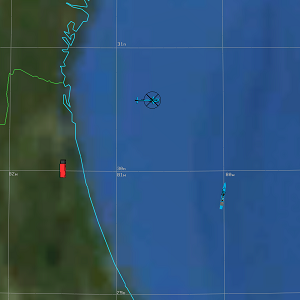

.. ****************************************************************************
.. CUI
..
.. The Advanced Framework for Simulation, Integration, and Modeling (AFSIM)
..
.. The use, dissemination or disclosure of data in this file is subject to
.. limitation or restriction. See accompanying README and LICENSE for details.
.. ****************************************************************************

.. demo:: new_guidance

.. |classification| replace:: Unclassified
.. |date|           replace:: 2012-09-10
.. |group|          replace:: Demos
.. |image|          replace:: images/new_guidance_demo.png
.. |tags|           replace:: n/a
.. |title|          replace:: new_guidance demo
.. |startup|        replace:: new_guidance1.txt
.. |summary|        replace:: This demo directory illustrates the use of the WSF_NEW_GUIDED_MOVER as well as the WSF_NEW_GUIDANCE_COMPUTER.

.. include:: demo_template.txt

| This demo directory illustrates the use of the WSF_NEW_GUIDED_MOVER as well as
| the WSF_NEW_GUIDANCE_COMPUTER. A weapon is given the new mover and processor
| to precisely control its fly-out. (The use of "WSF_NEW\_" has been deprecated.)
|
| To run the demos, type "run new_guidance[1-3].txt"

new_guidance1.txt (most complex)
--------------------------------

| Similar to the ship_ad_demo, a weapon is launched from a ship given
| a track from a remote sensor. During missile fly-out, the remote
| sensor platform provides in-flight target location updates to the
| missile. At terminal, a radar sensor on the missile provides final guidance
| to the target.

new_guidance2.txt
-----------------

| Has a jet aircraft use the weapon defined in new_guidance1.txt but
| fires at a pre-briefed track (no sensors).

new_guidance3.txt (least complex)
---------------------------------

| Demonstrates a weapon fly-out that has to go to a lat and lon enroute
| to the target. It does not use the weapon defined in the first two scenarios.
